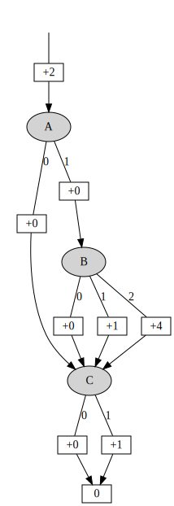

.. EVMDD Library for Python (pyevmdd) documentation master file, created by
   sphinx-quickstart on Mon Dec 21 14:32:55 2015.
   You can adapt this file completely to your liking, but it should at least
   contain the root `toctree` directive.

Welcome to |EVMDD| Library for Python (|pyevmdd|)'s documentation!
==================================================================

Introduction to |EVMDDs|
------------------------

An Edge-valued Multi-valued Decision Diagram (|EVMDD|) [CS02]_ is a data
structure that can be used to represent an arithmetic function, comparable to
how Binary Decision Diagrams (BDDs) are used to represent logic functions.
|EVMDDs| differ from BDDs in two ways: first, the variables on which the
represented functions depend can be multi-valued instead of only binary, and
second, the resulting function values are not read from the leaf node(s) of the
diagram, but rather from the traversed edges.

|EVMDDs| can be used in `automated planning
<http://en.wikipedia.org/wiki/Automated_planning_and_scheduling>`_ to represent
cost functions of *actions with state-dependent costs* [GKM15]_. This representation
allows, among others, (i) an efficient compilation to *actions with
state-independent* costs, which are generally easier to handle algorithmically,
and (ii) a faithful representation of action costs during the computation of
goal-distance heuristics.

As an example, consider the diagram in the following figure, representing the
function :math:`f(A,B,C) = AB^2 + C + 2` for variables :math:`A` and :math:`C`
that can take values :math:`0` or :math:`1` each, and variable :math:`B` that
can take the values :math:`0`, :math:`1`, or :math:`2`. The variable ordering is
:math:`A, B, C`.

.. _evmdd_figure:

   |EVMDD| Example

To see why this |EVMDD| represents the function :math:`f(A,B,C) = AB^2 + C + 2`,
consider the valuation :math:`A = 1`, :math:`B = 2`, and :math:`C = 0`. We would
then like to be able to read the function value :math:`f(1,2,0) = 6` from the
|EVMDD|. This is possible by traversing the path from top to bottom
corresponding to the given valuation and summing up the encountered edge weights
(given in rectangular boxes in the figure). For :math:`A = 1`, :math:`B = 2`,
and :math:`C = 0`, and starting with the dangling incoming edge of the topmost
node, we get the desired value :math:`2+0+4+0 = 6`.

As can be seen in the figure, |EVMDDs| help detecting and exploiting
independencies in the represented arithmetic function. For example, the
:math:`AB^2` part and the :math:`C` part of the example function are additively
decomposable and hence independent. As a consequence, the |EVMDD| allows to
first take care of the :math:`AB^2` part completely before independently taking
care of the :math:`C` part. Alternatively, for variable ordering :math:`C, A,
B`, the :math:`C` part could have been handled completely before the
:math:`AB^2` part. Notice also that if :math:`A=0`, then the :math:`AB^2` part
has to be zero and there is no point in branching over :math:`B` any more.
Therefore, on this |EVMDD| path, :math:`B` is skipped.

For arithmetic functions from a finite set of finite-domain variables with
ranges :math:`0, ..., D_i-1` to the whole numbers, reduced ordered |EVMDDs|
always exist and are unique. The canonicity requirements are similar to those
for BDDs (isomorphism reduction, Shannon reduction), and additionally, for each
node, the smallest weight of an outgoing edge must be zero.

Below, we will distinguish between fully reduced and quasi-reduced |EVMDDs|. We
call an |EVMDD| *fully reduced* if it is Shannon-reduced in the usual sense
(there is no node in the diagram such that all outgoing edges carry the same
weight and lead to the same successor node). In contrast, we call it
quasi-reduced if it is isomorphism reduced, but no Shannon reductions are
performed, i.e., on each path from top to bottom, each variable is branched over
exactly once. This may include branchings at nodes contributing no additional
information, such that all outgoing edges carry the same weight zero and lead to
the same successor node. Quasi-reduction instead of full reduction can be
necessary when |EVMDDs| are used to compute heuristics in AI planning [GKM15]_.

.. [CS02] | Gianfranco Ciardo and Radu Siminiceanu.
 | *Using Edge-Valued Decision Diagrams for Symbolic Generation of Shortest Paths.*
 | In Proc. FMCAD 2002. (PDF__)

__ http://web.cs.iastate.edu/~ciardo/pubs/2002FMCAD-EVMDD.pdf

.. [GKM15] | Florian Geißer, Thomas Keller, and Robert Mattmüller.
 | Delete Relaxations for Planning with State-Dependent Action Costs.
 | In Proc. IJCAI 2015. (PDF__)

__ http://ijcai.org/papers15/Papers/IJCAI15-225.pdf

Introduction to the |pyevmdd| Library
-------------------------------------

The purpose of the |pyevmdd| project is to provide a lightweight, pure
Python |EVMDD| library. It is still in a very early stage of development. So
far, the following features are supported (but unstable):

* Internal |EVMDD| representation.
* |EVMDD| output as a `Graphviz <http://www.graphviz.org/>`_ file plus
  visualization.
* Function evaluation.
* Arithmetic operations :math:`+` (addition), :math:`-` (subtraction, unary
  negation), and :math:`*` (multiplication) on |EVMDDs|.
* Choice between fully reduced and quasi-reduced |EVMDDs|.
* Input of arithmetic functions in Python syntax.

If you are looking for an excellent, mature, efficient, and general |EVMDD|
library that you can use in a serious application, we strongly recommend you to
first consider using `MEDDLY <http://meddly.sourceforge.net/>`_ instead of
|pyevmdd|. Compared to |pyevmdd|, MEDDLY has many advantages:

* Higher performance (C++ instead of Python, more optimization)
* Higher stability
* More supported operations

The |pyevmdd| library is explicitly not meant to compete with MEDDLY, but rather to
serve as a playground for small experiments with extremely small |EVMDDs|.
Compared to the |EVMDDs| MEDDLY has to handle in typical application scenarios,
the |EVMDDs| that result from cost functions in AI planning are relatively
small, which is why we developed this little |EVMDD| playground in the first place.

We only recommend using |pyevmdd| instead of MEDDLY if you agree with
all of the following points:

1. I do not care about performance.
2. I do not care about maturity or stability.
3. I do not care about few supported |EVMDD| operations (addition, subtraction
   and multiplication are enough for me).
4. I am fine with a library that needs Python 3, likely because my client code
   is written in Python 3 as well.
5. I want a simple high-level Python interface to |EVMDDs|.
6. I want to easily visualize my |EVMDDs|.
7. I want to avoid the hassle of installing/using/interfacing to a C++ library.

Installing the |pyevmdd| Library
--------------------------------

The sources can be cloned from the following git repository:

  https://github.com/robertmattmueller/pyevmdd

This library has the following requirements and dependencies:

* It requires Python 3.
* For |EVMDD| visualization, it requires Graphviz_
    - Additionally, under Linux, it requires ``xdot`` to display |EVMDDs|.
    - Under Mac OS X, |EVMDDs| are displayed in the Safari browser after ``dot``
      conversion to SVG.
* Several planned features (variable orderings, |EVMDD| based action
  compilation, evaluation of relaxed/abstract states), will probably make use
  of the `NetworkX <http://networkx.github.io/>`_ library.

Using the |pyevmdd| Library
---------------------------

Example Script
~~~~~~~~~~~~~~

Let us step through a small script that makes use of the interesting |pyevmdd|
features::

  #!/usr/bin/env python3
  # -*- coding: utf-8 -*-

  from evmdd import term_to_evmdd, evaluate, EvmddVisualizer

  # EVMDD construction
  function_term = 'A*B*B + C + 2'
  var_names = ['A', 'B', 'C']
  var_domains = {'A': 2, 'B': 3, 'C': 2}
  evmdd, manager = term_to_evmdd(function_term, var_names=var_names,
                                 var_domains=var_domains, fully_reduced=True)

  # EVMDD evaluation
  valuation = {'A': 1, 'B': 2, 'C': 0}
  value = evaluate(evmdd, valuation, manager)
  print(value)

  # EVMDD visualization
  visualizer = EvmddVisualizer(manager)
  visualizer.visualize(evmdd)

|EVMDD| Construction
~~~~~~~~~~~~~~~~~~~~

To construct an |EVMDD|, first, we give the function term to be represented as
an |EVMDD|, for instance :math:`AB^2 + C + 2`. The term must be given in Python
syntax using only variable names, constants, addition, subtraction, and
multiplication. Hence, we have to write::

  function_term = 'A*B*B + C + 2'

Although the variable names are clear from the given function term, the desired
variable ordering is not. To enforce the ordering :math:`A, B, C`, we state::

  var_names = ['A', 'B', 'C']

This information is still insufficient to construct an |EVMDD|, since the
variable domain sizes that determine the branching width at variable test
nodes still need to be given. Let us assume that variables :math:`A` and
:math:`C` can take two values each (:math:`0` and :math:`1`), and that variable
:math:`B` can take three values (:math:`0`, :math:`1`, and :math:`2`)::

  var_domains = {'A': 2, 'B': 3, 'C': 2}

Putting all this together, we can generate the desired |EVMDD|::

  evmdd, manager = term_to_evmdd(function_term, var_names=var_names,
                                 var_domains=var_domains, fully_reduced=True)

The function term is a required argument. The rest is optional. If no variable
ordering is given, the lexicographic ordering is used. If no domain sizes are
given, they are assumed to be :math:`2` for all variables. Finally, if
``fully_reduced`` is not specified, it is true by default, i.e., |EVMDDs| will
be fully reduced as opposed to quasi-reduced. The function ``term_to_evmdd``
returns the generated |EVMDD| together with the EvmddManager responsible for
managing its variables.

|EVMDD| Evaluation
~~~~~~~~~~~~~~~~~~

To determine function values, we first need the variable assignment for which we
want to evaluate our function. Let us assume we want to know the value of the
function :math:`f(A,B,C) = AB^2 + C + 2`, under the valuation :math:`A = 1`,
:math:`B = 2`, and :math:`C = 0`. We first define the valuation::

  valuation = {'A': 1, 'B': 2, 'C': 0}

Afterwards, we can compute :math:`f(1,2,0)`::

  value = evaluate(evmdd, valuation, manager)
  print(value)

As expected, this prints the number :math:`6`.

|EVMDD| Visualization
~~~~~~~~~~~~~~~~~~~~~

Finally, especially for debugging and for didactic purposes, it is useful to
have easy access to visualizations of |EVMDDs|. We use ``EvmddVisualizers`` for
that purpose::

  visualizer = EvmddVisualizer(manager)
  visualizer.visualize(evmdd)

Depending on OS details, this visualizes the |EVMDD| using Graphviz and either
``xdot`` display or conversion to SVG and web browser display. Figure
:ref:`evmdd_figure` above was produced this way.

.. note::

   The temporary files needed for visualization are *not* deleted after
   use. DOT and SVG files are stored in ``/tmp/evmdd-gvz-<UUID>.dot`` and
   ``/tmp/evmdd-gvz-<UUID>.dot.svg``, respectively. Optionally, a file prefix
   can be given as a named argument ``file_prefix`` to ``visualize``. The
   default corresponds to ``visualize(evmdd,
   file_prefix='/tmp/evmdd-gvz-<UUID>')``.

Planned Features and Applications
---------------------------------

Planned features and applications of this library include:

* Evaluation of relaxed/abstract states in AI planning.
* EVMDD-based action compilation and integration with Fast-Downward translator.
* Experiments with (static) variable orders.

Public API Reference
--------------------

The public API is still unstable and likely subject to changes in the future.
Currently, it consists of three modules:

* A core module (``evmdd.evmdd``) responsible for the internal representation of
  |EVMDDs|, arithmetic operations on them, and computation of function values.
* An input module (``evmdd.parser``) responsible for translating arithmetic
  function terms specified in Python syntax to |EVMDDs|.
* An output module (``evmdd.graphviz``) responsible for dumping |EVMDDs| in
  Graphviz format and displaying them.

In the following, we give the API documentation of the three modules.

|EVMDD| Core Module
~~~~~~~~~~~~~~~~~~~

.. automodule:: evmdd.evmdd
   :members: Edge, Node, EvmddManager, evaluate

Function Term Input Module
~~~~~~~~~~~~~~~~~~~~~~~~~~

.. automodule:: evmdd.parser
   :members: term_to_evmdd

Visualization/Output Module
~~~~~~~~~~~~~~~~~~~~~~~~~~~

.. automodule:: evmdd.graphviz
   :members: EvmddVisualizer

License
-------

Copyright (C) 2016 Robert Mattmüller

This program is free software: you can redistribute it and/or modify
it under the terms of the GNU General Public License as published by
the Free Software Foundation, either version 3 of the License, or
(at your option) any later version.

This program is distributed in the hope that it will be useful,
but WITHOUT ANY WARRANTY; without even the implied warranty of
MERCHANTABILITY or FITNESS FOR A PARTICULAR PURPOSE.  See the
GNU General Public License for more details.

You should have received a copy of the GNU General Public License
along with this program.  If not, see <http://www.gnu.org/licenses/>

.. toctree::
   :maxdepth: 2

.. Changelog
   ---------

   TODO!

   Indices and tables
   ==================

   * :ref:`genindex`
   * :ref:`modindex`
   * :ref:`search`

   |EVMDD| replace:: EV\ :superscript:`+`\ MDD

.. |EVMDD| replace:: EVMDD
.. |EVMDDs| replace:: |EVMDD|\ s
.. |pyevmdd| replace:: `pyevmdd`
